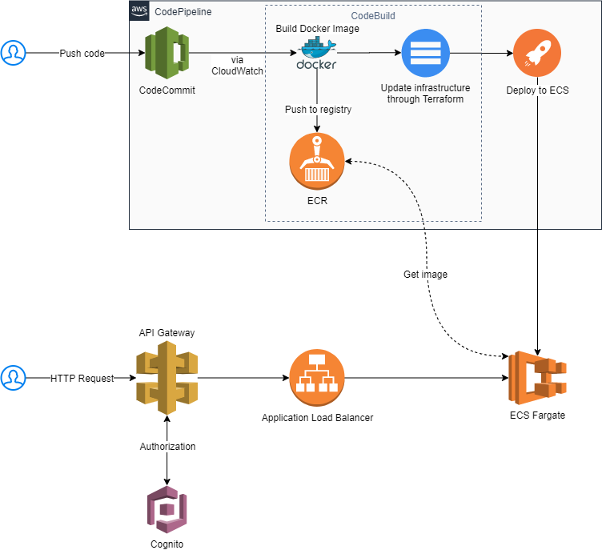

# Deploying containerized application in Amazon ECS with CI/CD pipeline
This repository contains Terraform source files for deploying your app to AWS using automated CodePipeline CI/CD.

The application is automatically built on every push to `master` branch in AWS CodeCommit repository.

Below is a high-level overview of the architecture:

## Pipeline steps

1. User pushes a commit to CodeCommit repository
2. CloudWatch triggers a CodePipeline project
3. Source is downloaded from CodeCommit
4. Build stage builds a Docker image based on `Dockerfile` in your repo
5. Docker image is pushed to AWS ECR
6. Changes to infrastructure are applied based on Terraform files in `infra/` directory
7. Docker image is deployed to AWS ECS Fargate and a rolling update is initiated

## Access to application

Application can be accessed via two entry points:

1. Application Load Balancer (no authorization is required)
2. API Gateway (requires authorization through AWS Cognito)

## Scalability

If needed, auto-scaling can be enabled in ECS based on CloudWatch metrics. This repository does not have auto-scaling enabled and only one task/container is launched.

## How to add a new service

Deploying a new service into the infrastructure requires:

1. New CodeCommit repository
2. New ECS service
3. New ALB
4. New API Gateway stage
5. Update CodePipeline to use [action variables](https://docs.aws.amazon.com/codepipeline/latest/userguide/actions-variables.html) to reuse existing pipeline to deploy the correct ECS service
